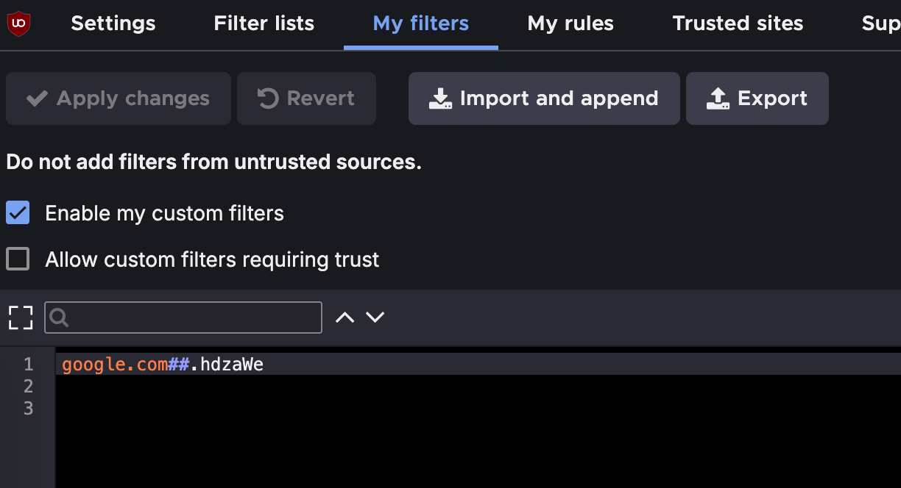
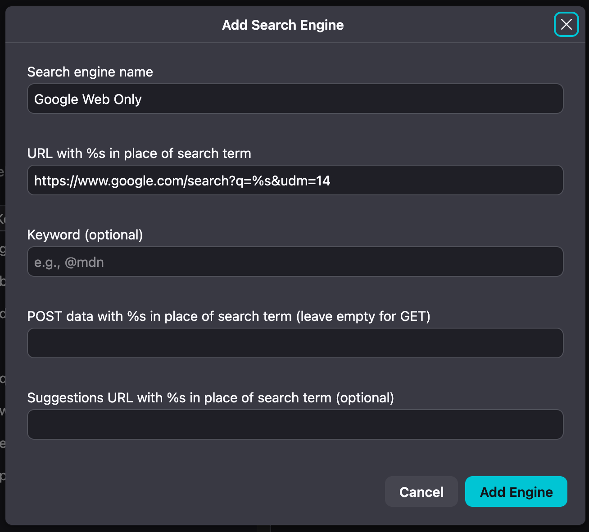

This is a quick tutorial to get rid of **Google’s AI Overview** powered by Gemini.

## Why this?

Since AI Overview was introduced, the Google search results page has been inundated with pre-processed answers that often don't satisfy the original search intent.

## Hide AI Overview

To hide the AI Overview section, we need a content blocker first.  
I personally use [uBlock Origin](https://ublockorigin.com/), a free, open-source browser extension.
I am on Firefox, but it is available for other browsers too.

1. Go to the uBlock Origin preferences
2. Navigate to the **My filters** tab
3. Make sure that **Enable my custom filters** is checked, then paste the following rule:

```bash
google.com##.hdzaWe
```

4. Finally, click **Apply changes**.



Keep in mind that this will only **hide** the AI Overview section.  
So, if we want something more radical, we will have to disable AI Overview as follows.

## Disable AI Overview

We can get only web results, like in the old days, by appending the `&udm=14` parameter to the Google Search URL.  
For instance `https://www.google.com/search?q=giorgio+delle+grottaglie` becomes `https://www.google.com/search?udm=14&q=giorgio+delle+grottaglie`.

Of course we want this to be automatic, and there's a simple way to do it by adding a new search engine to your browser.  
On Firefox we'll need to:

1. Open the **Settings**
2. Go to the **Search** section -> **Search Shortcuts**
3. Add a new search engine



The same can be done on Chrome and Safari.  
From now on, any time we use this custom search engine, you will not see any results provided by AI Overview.
