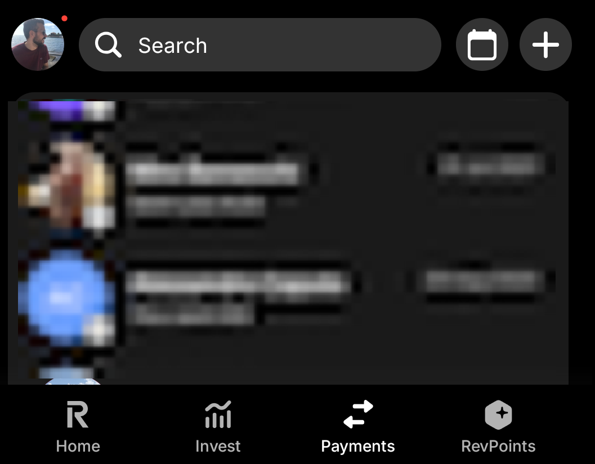
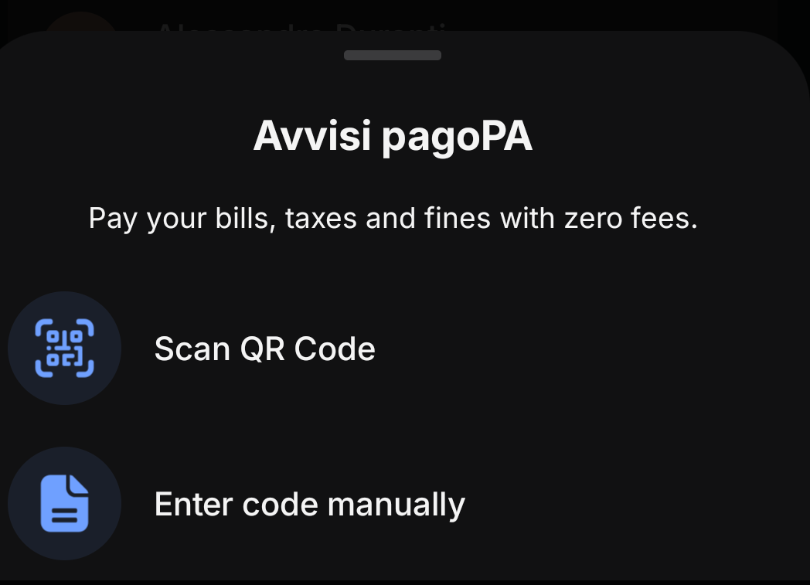
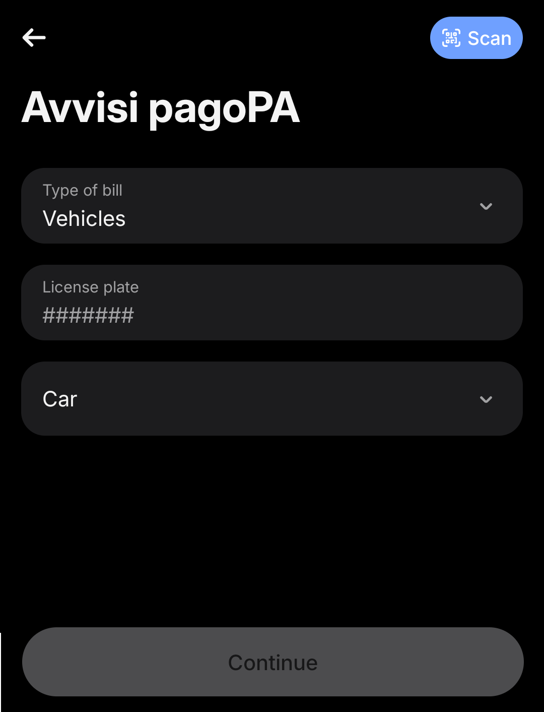

If you're based in Italy and own a car or a motorcycle, you'll have to pay the **Bollo**, a yearly vehicle tax you owe whether you use the vehicle or not.  
The problem? Whether you pay it through online banking, at the post office, or in a shop, the service usually adds an extra commission of **€1-3**.  
Since early 2022, Revolut has supported the _PagoPA_ system, allowing you to pay taxes, duties, and fees **with zero commission**, regardless of your plan. This is especially useful for the Bollo, the waste tax (TARI), or even fines.

Here’s how to do it in just a few steps.

#### Open the Revolut app and make sure you have sufficient funds

If you haven't already, download the Revolut app.  
Log in to your Revolut account and check that you have enough funds in your Revolut account to cover the car tax payment. If needed, top up your Revolut account from your linked bank account or another funding source.

#### Go to the Payments section

Tap on the **Payments** option in the app navigation menu and click the **plus** button in the top right corner.

On the next screen, choose the **pagoPA** option.

#### Go to the **Avvisi pagoPA** section

PagoPA notices can be paid either via QR code or by entering the data manually. In this guide, we'll cover the second option, so select **Enter code manually**.

#### Enter the payment details

From the **Type of bill** menu, select **Bollo Veicoli — Vehicles**, then enter the vehicle license plate and type.  
Once the details are entered, the **Continue** button will become active, and tapping it will take you to a summary screen with the amount, where you can complete the payment.

#### Paying TARI and fines

Want to pay the waste tax (TARI) or fines with Revolut without fees? You can follow this same guide with just a few small differences.  
If you choose **Enter code manually**, then from the **Type of bill** menu select **Notice** and make sure you have the **Codice fiscale ente creditore** and the **Codice avviso** handy.  
If you choose **Scan QR Code**, the app will automatically retrieve all the data.
Once done, complete the payment as above.

---

I wrote this guide because I couldn’t find a clear explanation elsewhere, even though the process is quite simple.  
If you don’t have Revolut yet and want to support this content, here’s my [invite link](https://www.revolut.com/it-IT/referral/?referral-code=giorgim0sy%21NOV1-25-AR-L1-MDL-ROI).

And if you’re looking for the original Italian version, you can find it [here on Medium](https://medium.com/@giorgio.dg/come-pagare-il-bollo-auto-moto-con-revolut-senza-commissioni-7594bb340312).

So, why pay extra when you could spend that euro on a _caffè e cornetto_ instead?  
Give it a try and let me know if it helped!
