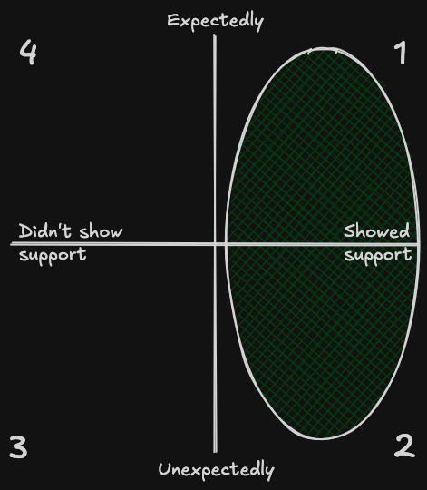

A while back I found an interesting job opening, and while going through the application form I came across the following question.

> What's something new you learned recently?

I started moving my fingers nervously while I was trying to find the right words to craft a meaningful response. One which could be fair as well as catchy enough to stand out.  
There had to be something, but I had not practiced expressing it enough. After wrestling for ten minutes to answer, it hit me: **layoffs**.  
That was the trigger for learning so many new things.

Photo by Elin Tabitha on [Unsplash](https://unsplash.com/photos/a-person-standing-in-the-middle-of-a-large-body-of-water-6j31et5uBnw?utm_source=unsplash&utm_medium=referral&utm_content=creditCopyText)

## Layoff? What is that?

Let's start from a culture-specific nuance.  
While in English it's easy to distinguish _layoff_ from _firing_, it's not the same in Italian, because both are often translated as _licenziamento_.  
Although the publicly visible effect is the same, no longer having a job, _layoff_ is usually the result of structural challenges within the company, while _firing_ is the result of an employee's performance or behavior.  
More than once, I felt the need to explain which category I fell into, to preserve my professional image, if that was ever even necessary.  
Having made this necessary introduction, here's the opinionated survival kit I put together to navigate it all.

## Pause and process

Your first job is to **clear your head**. Detach even if it's hard not to check your Slack or mailbox and no one is asking you for an ETA anymore. It's tough, do it anyway.  
Surround yourself with your loved ones, call your close friends and celebrate. It's a nice excuse to be out and have drinks together.

## Volunteer

The good you do comes back sooner or later.  
Find a cause, **escape from your first-world problems**, and help someone. Step out of your bubble, put yourself in someone else's shoes, and eventually appreciate the little things you take for granted from your privileged perspective.  
In my case, I joined [Global Mentorship Initiative](/showcase/global-mentorship-initiative) where I could offer mentoring to college students globally, helping them prepare for their first career opportunities.

## Pulse check your network

When you move on, you sometimes realize that people you thought were business friends will no longer speak with you. Here's the best time to figure out who your **true business friends** are.  
I must genuinely admit that it was a recurring thought, so much so that I was able to classify them into four quadrants:

1. Who showed support, expectedly
2. Who showed support, unexpectedly
3. Who did not show support, unexpectedly
4. Who did not show support, expectedly

Alright, I’m probably a bit too much into quadrants. The point is to realize who you can count on, distinguishing them from those **who are only there when things are going well**.  
So, if someone you considered a business friend is ghosting you on LinkedIn and you didn't expect it, that's part of the game and you had better accept it and move on.  
**Focus on 1. and 2**.  
And it took me a while because **when I choose to be nice and supportive to colleagues, I expect the same in return.**

## Set up a new routine

Build a lightweight agenda to keep yourself busy and give your days structure, so you end the week with a sense of accomplishment.  
What worked for me, in addition to the mentoring I mentioned above, was scheduling calls with people in my professional network I hadn’t heard from in a while.
Over time, I filled that agenda with technical tasks to stay hands-on and to keep my career development going, like:

- [rebuilding this website from scratch](/blog/welcome-to-my-new-website)
- [the Cloud Resume Challenge](/showcase/project-the-aws-cloud-resume-challenge)
- [my very first Firefox Add-on](/showcase/project-youtube-music-notifier)

Eventually, looking for a new job became part of this routine.  
Do it whenever you're mentally ready.  
When it's time, you may want to pick one or two days a week to look for jobs. I felt that Mondays were pretty calm and I could have the right focus to apply for enough jobs.

## Conclusion

It took me some time to sort out my thoughts and a good deal of courage to speak openly about this situation. But transparency has always been one of the pillars of my leadership style.  
So, if you have found yourself in a similar situation, know that you are not alone, and I hope you have found these words helpful.  
If you haven't, remember that those going through it will be very happy to receive your support, or even just a simple

> It was great working with you, good luck
