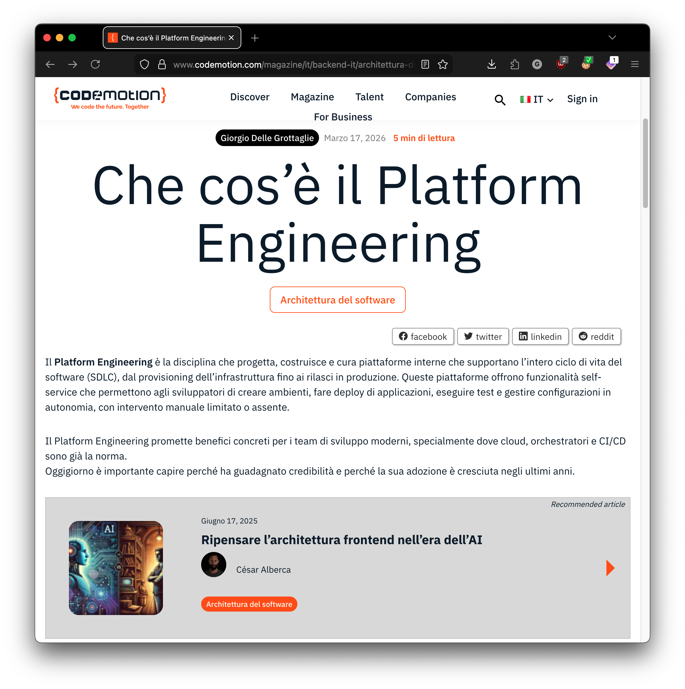

I published an article in Codemotion Magazine to explain what Platform Engineering is.  
Codemotion is one of the largest European tech communities and conference organizers.  
The piece is a practitioner‑oriented explainer that clarifies why Platform Engineering is worth adopting today: from core patterns (golden paths, self‑service, orchestrators) to measurable impact on DORA metrics, costs, reliability, and talent attraction. It walks through the concrete problems an internal platform solves and closes with a practical, step‑by‑step getting‑started guide: mining ops tickets, defining a metric baseline, prototyping golden paths, and scaling adoption iteratively.

