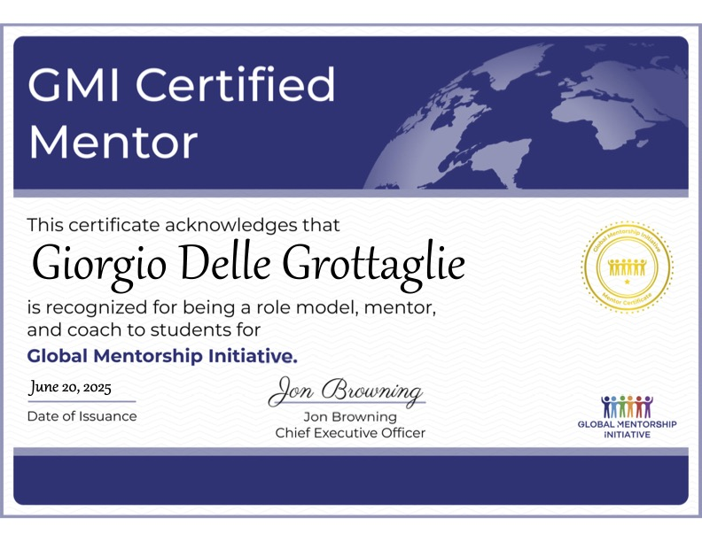

Global Mentorship Initiative (GMI) offers mentoring to college students globally, helping them prepare for their first career opportunities.  
I support mentees with guidance on networking, career planning, communication skills, job search strategies, and workplace readiness.

