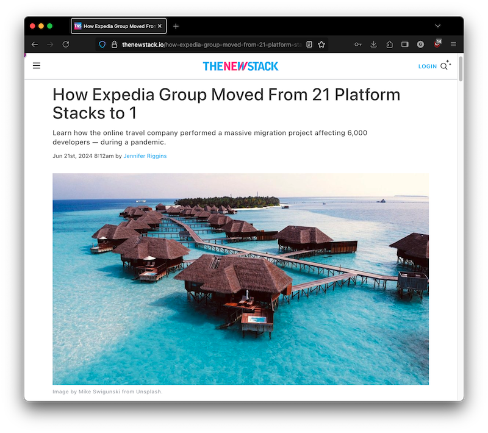

I spoke with The New Stack about a platform transformation I was part of at Expedia Group, where we consolidated multiple technology stacks into a unified platform. The initiative focused on standardizing developer tools, improving documentation discoverability with app-centric docs, and streamlining onboarding.  
It was rewarding to see how clearer "golden paths" and shared productivity metrics helped thousands of engineers deliver more efficiently.

