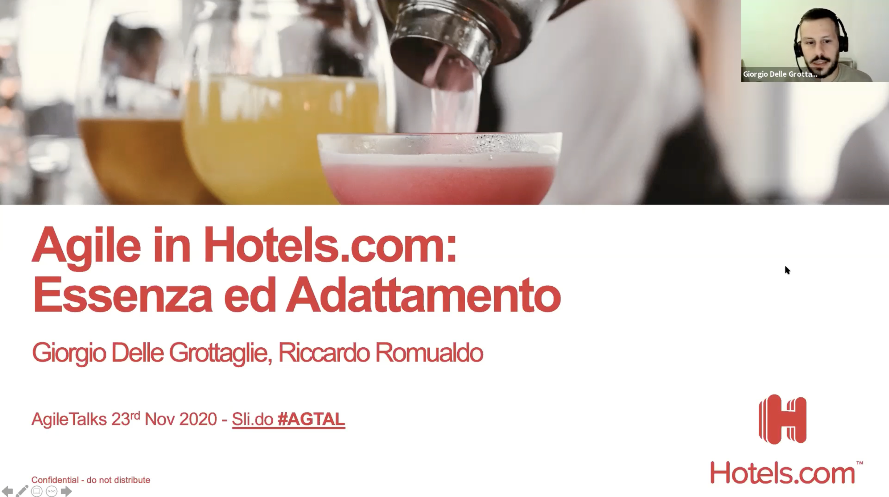

I co-presented this talk with a colleague from Expedia Group at the **Agile Talks Meetup** in Rome.  
We shared our view on how agile and traditional organizations can effectively collaborate in complex environments. We explored the principles of the Agile Manifesto through our daily practices and tools, and shared how we adapted them during a real-world collaboration with a non-agile partner.

