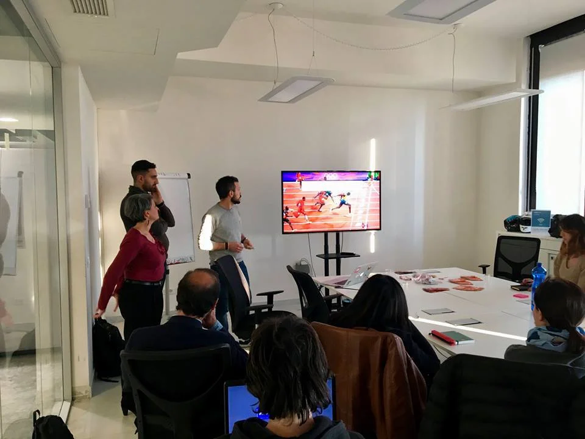

Alongside my colleagues from Expedia Group, I presented a talk at the **Agile Talks Meetup** in Rome about one of the most debated topics in agile development: estimation.  
Inspired by the #NoEstimates movement, we shared our journey toward forecasting as a practical alternative to traditional estimation methods.  
The session discussed pros and cons of both approaches and introduced a tool designed to predict project completion dates based on historical data from similar projects.

